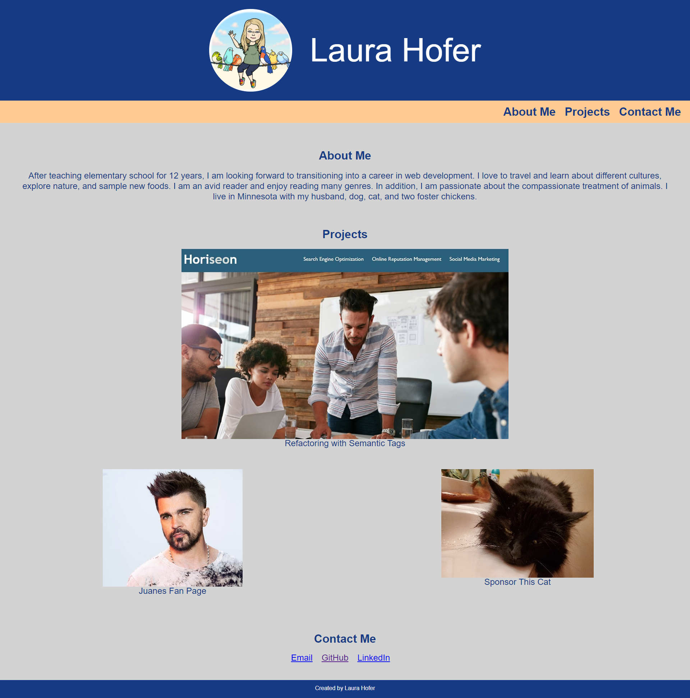

# Bootcamp Homework #2: Advanced CSS Portfolio

## Objective

Created a professional portfolio that includes About Me, Project, and Contact sections. The page is responsive to different display sizes.  

## Screen Shot

  

## Link to deployed page

[Here is the link to my deployed code.](https://ljhofer.github.io/02-advanced-css-portfolio/)

## Technologies used

HTML, CSS

## Contributor - Laura Hofer - GitHub: ljhofer